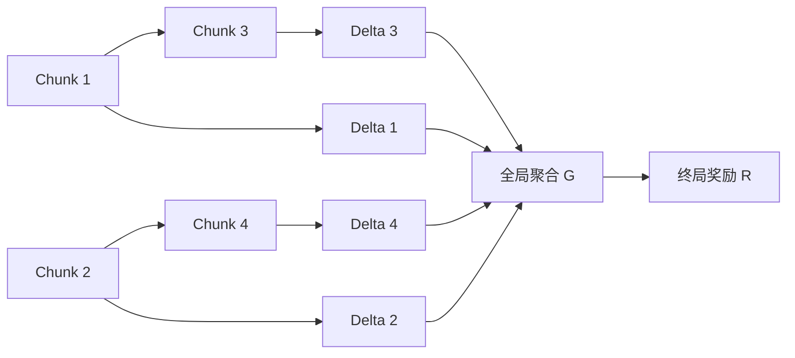

# 局部 Delta 与整体 Value：完整讨论、数学推导与证明边界

Last updated: 10/02/2026

本文整理关于“局部 delta 为什么可能比终局 value 更容易学习”的完整讨论。内容包括最初的直觉、设定的修改、信息论中间结论、反例、Fano 样本复杂度分离，以及未来随机性引起的估计方差。本文按逻辑顺序整理讨论，并修正不能直接成立的推论。

## 1. 最初的问题与最终关注点

最初考虑一个 chunk 序列 $C_1,\ldots,C_n$，每个 chunk 对应一个局部值 $L_t$，整个序列对应一个二元终局奖励 $R$。直觉是：局部值与对应 chunk 的关系明确，而终局奖励需要结合不同 chunk 的贡献，因此局部信号会在整体结果中被“平均掉”。

讨论逐步将局部值改称为 $\Delta_t$，并明确以下目标：

> Chunk 之间只有稀疏依赖，局部 delta 主要受局部关系影响；前缀 value 还受到尚未观察的未来贡献影响。因此，局部监督可能更直接、噪声更小，学习或估计成本也可能更低。

需要区分三个问题：

| 问题 | 对应数学对象 | 可以支持的结论 |
| --- | --- | --- |
| Delta 是否保留更多序列信息？ | $I(\Delta_{1:n};C_{1:n})$ 与 $I(R;C_{1:n})$ | 信息压缩与监督信息差异 |
| 未来是否增加标签随机性？ | $\operatorname{Var}(R\mid C_{\le t})$ | 采样标签的条件噪声 |
| Delta 是否更容易学习？ | 估计误差、泛化误差、样本复杂度 | 必须结合函数类与监督协议证明 |

三者有关联，但不能相互替代。尤其不能仅由“信息更多”或者“目标更随机”直接推出普遍的学习难度排序。

## 2. 符号与问题结构

| 符号 | 含义 |
| --- | --- |
| $C=C_{1:n}$ | 完整随机 chunk 序列 |
| $c_{1:n}$ | 序列的一个具体实现 |
| $X=C_{\le t}$ | 当前可见前缀 |
| $\Delta_t$ | Chunk $t$ 的局部贡献，可以是多值变量 |
| $D=\Delta_{1:n}$ | 完整局部贡献向量 |
| $Z=\Delta_{t+1:n}$ | 尚未观察的未来局部贡献 |
| $F$ | 完整序列到终局奖励的映射 |
| $G$ | 局部贡献向量到终局奖励的聚合函数 |
| $R$ | 终局奖励，主要考虑二元奖励 |
| $V_t(X)$ | 前缀对应的期望终局奖励 |
| $\Theta$ | 学习问题中未知模型的参数或索引 |

这里的 delta 指局部贡献，不自动等同于 TD error、advantage，或相邻前缀 value 的差。若要与某个具体算法中的 delta 对应，需要另外核对定义。

### 2.1 稀疏依赖

可以用一个按时间排序的有向无环图表示 chunk 依赖：

$$
P(C_{1:n})=\prod_{t=1}^{n}P(C_t\mid C_{\operatorname{pa}(t)}),
$$

$$
\operatorname{pa}(t)\subseteq\{1,\ldots,t-1\},
\qquad |\operatorname{pa}(t)|\le k\ll n.
$$

稀疏图约束直接依赖的数量，但不保证相关性弱，也不保证信息不会沿长链传播。

还可以另外规定 delta 的局部函数结构：

$$
\Delta_t=f_t(C_{\mathcal N_t}),
\qquad |\mathcal N_t|\le k.
$$

“Chunk 分布具有稀疏依赖”和“delta 只依赖少量输入”是两个不同的假设。下文最简单的模型取 $\mathcal N_t=\{t\}$。

图中的具体依赖边仅作示意。

## 3. 第一版设定：确定性 Delta

最初假设

$$
\Delta_t=f_t(C_t),\qquad R=G(D)=F(C).
$$

给定 chunk，其 delta 不需要未来信息即可确定。“无需未来信息”不代表它与未来随机变量统计独立。

对于离散变量，

$$
H(\Delta_t\mid C_t)=0,
$$

$$
I(\Delta_t;C_t\mid C_{<t})=H(\Delta_t\mid C_{<t}).
$$

最后一项一般不能继续写成 $H(\Delta_t)$；这需要 $\Delta_t$ 与过去 chunk 独立。

另一个需要修正的直觉是：“不重要的 chunk 对应更平的局部条件分布。”在当前确定性假设下，所有 $P(\Delta_t\mid C_t)$ 都是点质量。重要性应另外定义，例如改变该 delta 是否影响奖励、影响幅度有多大，或它对奖励提供多少信息。

### 3.1 完整序列不会因为聚合而出现条件随机性

$$
P(R=r\mid C=c)
=\mathbf 1\{r=G(f_1(c_1),\ldots,f_n(c_n))\}.
$$

因此，

$$
H(R\mid C)=0,\qquad I(R;C)=H(R).
$$

聚合函数可能复杂，但完整输入上的真实条件分布仍然是点质量。最初“$P(R\mid C_{1:n})$ 被不同 chunk 组合平均后变平”的表述不成立；不同组合只有在未被观察、被边缘化时才会产生混合。

### 3.2 第一个关键中间结论

由于 $D$ 是 $C$ 的函数、$R$ 是 $D$ 的函数，

$$
\boxed{I(R;C)=H(R)\le H(D)=I(D;C).}
$$

它表示：整个 delta 向量保留的序列信息，至少与终局奖励一样多。

信息差可以精确写成

$$
\boxed{I(D;C)-I(R;C)=H(D\mid R).}
$$

若同一个奖励对应多个具有正概率的 delta 向量，差值严格为正；若奖励能够反向确定整个 delta 向量，则两者相等。

这一步不需要稀疏依赖假设，也不保证完整序列对终局奖励的信息少于单个 chunk 对单个 delta 的信息。

## 4. 第二版设定：多值、低条件熵的 Delta

令 delta 为多值离散变量，允许一定随机性：

$$
\Delta_t\in\mathcal D_t,\qquad H(\Delta_t\mid C_t)<\epsilon,\qquad \epsilon>0.
$$

为避免熵的技术问题，本节假设相关离散熵有限，对数以 2 为底。Delta 可以取多个数值，不限于 binary。

这个条件允许条件熵等于零；若要求非零随机性，需要另外规定 $H(\Delta_t\mid C_t)>0$。低条件熵是平均意义上的约束，不保证每一个具体 chunk 的条件分布都高度集中。

也不能仅由这个条件推出

$$
P(D\mid C)=\prod_tP(\Delta_t\mid C_t).
$$

这个乘积分解需要额外的条件独立与局部生成假设。

### 4.1 整体条件熵与互信息下界

由链式法则及增加条件不会增加离散条件熵，

$$
\begin{aligned}
H(D\mid C)
&=\sum_{t=1}^{n}H(\Delta_t\mid\Delta_{<t},C_{1:n})\\
&\le\sum_{t=1}^{n}H(\Delta_t\mid C_t)\\
&<n\epsilon.
\end{aligned}
$$

所以

$$
\boxed{I(D;C)>H(D)-n\epsilon.}
$$

每个位置的小条件熵会累积成 $n\epsilon$，不能自动忽略。

### 4.2 保留充分性时的关键结论

继续假设 $R=F(C)$，并要求 delta 向量对奖励充分：

$$
R\perp C\mid D.
$$

则

$$
H(R\mid D)=H(R\mid C,D)+I(R;C\mid D)=0.
$$

因此仍存在 $G$，使 $R=G(D)$ 几乎处处成立。它约束了 delta 噪声：给定同一个完整序列，不同可能的 delta 向量必须落在同一奖励类别中。

新的信息关系为

$$
\boxed{I(R;C)=H(R)\le I(D;C)\le H(D).}
$$

这里一般不再有 $I(D;C)=H(D)$。信息差满足

$$
\begin{aligned}
I(D;C)-I(R;C)
&=I(D;C\mid R)\\
&=H(D\mid R)-H(D\mid C)\\
&>H(D\mid R)-n\epsilon.
\end{aligned}
$$

因此，一个严格不等式的充分条件是

$$
H(D\mid R)>n\epsilon,
$$

等价地，$H(D)-H(R)>n\epsilon$。精确的严格性条件则是 $I(D;C\mid R)>0$。

这个表达还说明：增加与 chunk 无关的 delta 噪声，并不增加有用的信息。

若不保留充分性，只保留 $R=F(C)$，仍有

$$
I(D;C)-I(R;C)>H(D)-H(R)-n\epsilon,
$$

但不再无条件保证差值非负。

## 5. Averaging 应该发生在哪里：前缀 Value

定义

$$
V_t(c_{\le t})=\mathbb E[R\mid C_{\le t}=c_{\le t}].
$$

当 $R$ 为二元奖励时，它就是成功概率。

在确定性 delta 模型下，

$$
V_t(c_{\le t})
=\sum_{c_{>t}}G(f_1(c_1),\ldots,f_n(c_n))
P(c_{>t}\mid c_{\le t}).
$$

如果 delta 是随机的且仍满足 $R=G(D)$，通用表达为

$$
V_t(x)=\sum_dG(d)P(D=d\mid X=x).
$$

因此，averaging 对应的是对未观察贡献及其条件随机性的边缘化。

如果额外假设贡献可加，$R=g(\sum_i\Delta_i)$，在确定性 delta 模型下可以写成

$$
V_t(c_{\le t})
=\mathbb E\!\left[
g\!\left(\sum_{i\le t}f_i(c_i)+\sum_{i>t}f_i(C_i)\right)
\middle|C_{\le t}=c_{\le t}
\right].
$$

完整 delta 向量充分，不意味着前缀 delta 也充分。前缀 chunk 可能额外携带预测未来 chunk 的信息。用 $\Delta_{\le t}$ 替换条件 $C_{\le t}$，需要另加例如 $R\perp C_{\le t}\mid\Delta_{\le t}$ 的假设。

## 6. 严格的信息稀释例子：多数投票

取 $n=2m+1$、$m\ge1$，并令

$$
C_i\overset{\mathrm{iid}}{\sim}\operatorname{Bernoulli}(1/2),
\qquad \Delta_i=C_i,
\qquad R=\mathbf1\!\left\{\sum_i\Delta_i\ge m+1\right\}.
$$

每个 chunk 对自身 delta 提供完整信息：

$$
I(\Delta_i;C_i)=1.
$$

令其他 chunk 恰好平票的概率为

$$
q_m=\frac{\binom{2m}{m}}{2^{2m}}.
$$

只有其他 chunk 平票时，改变 $C_i$ 才会改变奖励。因此

$$
P(R=1\mid C_i=1)=\frac12+\frac{q_m}{2},
\qquad
P(R=1\mid C_i=0)=\frac12-\frac{q_m}{2}.
$$

由 $H(R)=1$，

$$
I(R;C_i)=1-h_2\!\left(\frac12+\frac{q_m}{2}\right),
$$

其中 $h_2(p)=-p\log_2p-(1-p)\log_2(1-p)$。利用

$$
q_m\sim\frac1{\sqrt{\pi m}},
\qquad
1-h_2(1/2+x)=\frac{2x^2}{\ln2}+O(x^4),
$$

得到

$$
\boxed{I(R;C_i)=\Theta(1/n),\qquad I(\Delta_i;C_i)=1.}
$$

这是单个 chunk 的局部信号被其他贡献稀释的严格例子。不过完整序列仍有 $I(R;C_{1:n})=1$。

互信息链式法则还给出

$$
\sum_{t=1}^{n}I(R;C_t\mid C_{<t})=1,
\qquad
\sum_{t=1}^{n}I(\Delta_t;C_t\mid C_{<t})=n.
$$

前一式说明平均条件信息增量为 $1/n$，不意味着每个位置的增量都相等。

在这个例子中，记 $s_t=\sum_{i\le t}c_i$，则前缀 value 为

$$
V_t(c_{\le t})
=P\!\left(\operatorname{Binomial}(n-t,1/2)\ge m+1-s_t\right).
$$

如果分布与聚合规则已知，这个 value 可以直接计算。因此，上述信息稀释证明本身不是学习困难的证明。

## 7. 为什么信息更多还不等于更容易学习

低条件熵描述真实数据分布中的剩余不确定性。学习复杂度则涉及未知规律、有限训练数据与泛化。确定性的函数可以难学，而随机标签的条件均值可以很简单。

一个非恒定奖励的反例是

$$
C=(X,Z),\qquad X\in\{0,1\},
$$

$$
\Delta=2f(Z)+X,\qquad R=X=\Delta\bmod2,
$$

其中 $f$ 是取多个非负整数值的未知函数，$Z$ 的取值集合有限。

这里 delta 多值、$H(\Delta\mid C)=0<\epsilon$，且 delta 充分决定奖励。但预测奖励只需读取 $X$，预测 delta 还需要学习 $f$。当前的信息量假设没有排除这种情况。

因此，“delta 多值”“局部条件熵小”“delta 信息更多”都不能单独保证 delta 更容易学习。

## 8. 路线一：用 Fano 证明真正的样本复杂度分离

Fano 可以用于证明学习优势，但应研究 $I(\Theta;D_{\mathrm{train}})$，即训练数据提供多少关于未知模型的信息，而不是只比较 $I(R;C)$ 和 $I(\Delta;C)$。

还需要同时给出终局监督的必要样本数下界，以及局部监督的可达样本数上界。

### 8.1 一个具有多值 Delta 的具体模型

令每条轨迹中的 chunk 独立：

$$
C_t\sim\operatorname{Bernoulli}(1/2),\qquad \theta_t\in\{0,1\}.
$$

参数 $\theta_t$ 是未知的局部规律。定义

$$
\Delta_t=(2+\theta_t)C_t\in\{0,2,3\},
$$

$$
R=\left(\sum_t\Delta_t\right)\bmod2
=\left(\sum_t\theta_t C_t\right)\bmod2.
$$

对每个固定真实参数 $\theta$，都有 $H_\theta(\Delta_t\mid C_t)=0<\epsilon$。后面在未知参数上引入先验，是为了分析学习难度，不能与固定模型下的条件熵混淆。

### 8.2 局部监督的可达上界

每当某条轨迹中 $C_t=1$，就可以从 $\Delta_t$ 识别 $\theta_t$。观察 $N$ 条独立轨迹后，至少一个位置始终没有出现 1 的概率至多为

$$
P(\exists t\text{ 未被识别})\le n2^{-N}.
$$

因此，存在一个局部监督学习器，只需

$$
N=\left\lceil\log_2(n/\eta)\right\rceil
$$

条轨迹，就能以至少 $1-\eta$ 的概率恢复全部局部参数，从而恢复整个奖励函数。

### 8.3 终局监督的必要下界

令 $\Theta$ 均匀分布在 $\{0,1\}^n$ 上。终局训练数据为

$$
D_{\mathrm{terminal}}=\{(C^{(j)},R^{(j)})\}_{j=1}^{N}.
$$

输入分布不依赖 $\Theta$，每条轨迹只提供一个二元标签，因此

$$
I(\Theta;D_{\mathrm{terminal}})
=I(\Theta;R^{(1:N)}\mid C^{(1:N)})\le N.
$$

Fano 不等式给出

$$
P(\widehat\Theta\ne\Theta)
\ge1-\frac{I(\Theta;D_{\mathrm{terminal}})+1}{\log_2(2^n)}
\ge1-\frac{N+1}{n}.
$$

若要求对所有参数都达到不超过 $\eta$ 的识别错误率，则平均错误率也必须满足该要求，从而必要条件为

$$
N\ge(1-\eta)n-1.
$$

对固定 $\eta\in(0,1)$，这建立了

$$
\boxed{N_{\mathrm{local}}=O(\log n),\qquad N_{\mathrm{terminal}}=\Omega(n).}
$$

任意两个不同参数对应的奖励函数，在均匀输入下都有 $1/2$ 的不一致概率。因此，若一个二元预测函数与真实函数的不一致概率严格小于 $1/4$，就能通过最近候选函数唯一识别真实参数。这说明识别下界也可以转化为相应高概率预测保证的下界。

### 8.4 这个证明的适用范围

- 这是一个明确模型中的存在性分离，不是所有稀疏依赖模型的通用定理。
- 它比较按轨迹数计算的监督成本。一条局部监督轨迹提供 $n$ 个 delta 标签，终局监督轨迹只提供一个奖励标签。
- 如果局部标签来自额外估计器，需要计算生成这些标签的成本和误差。
- 它针对完整序列上的奖励映射，不能自动推出前缀 value 的复杂度下界。
- 真正产生优势的是局部参数可分别识别，而终局标签混合了多个未知参数；delta 多值本身并不是原因。

一般地，若固定且已知的 $G$ 将 delta 标签映射为奖励标签，终局数据是局部数据的确定性变换，因此 $I(\Theta;D_{\mathrm{terminal}})\le I(\Theta;D_{\mathrm{local}})$。这仍不自动保证严格的样本复杂度分离，上面的上界与下界才完成了具体模型中的比较。

## 9. 路线二：未来随机性增加 Value 标签的条件方差

这是最直接对应“delta 更明确，而 value 还受到未来局部贡献影响”的路线。

记当前输入为 $X=C_{\le t}$，未来贡献为 $Z=\Delta_{t+1:n}$，并定义

$$
V(X)=\mathbb E[R\mid X].
$$

条件方差分解给出

$$
\boxed{
\operatorname{Var}(R\mid X)
=\mathbb E[\operatorname{Var}(R\mid X,Z)\mid X]
+\operatorname{Var}(\mathbb E[R\mid X,Z]\mid X).
}
$$

第二项刻画不同未来贡献所对应的条件期望奖励的变化。它非负；当未来贡献确实改变条件期望奖励时才严格为正。

若给定 $X,Z$ 后奖励完全确定，则第一项为零，标签的条件随机性全部来自尚未观察的未来贡献。如果当前 delta 仍有无法被 $X,Z$ 消除的随机性，则不能直接删去第一项。

### 9.1 条件熵版本

对于二元奖励，

$$
H(R\mid X)-H(R\mid X,Z)=I(R;Z\mid X)\ge0.
$$

这表明观察未来贡献平均而言可以减少奖励不确定性。它并不自动给出 $H(R\mid X)>H(\Delta_t\mid C_t)$；两者的数值尺度、变量范围和依赖结构仍需要比较。

### 9.2 固定前缀上的 Monte Carlo 估计成本

固定一个前缀 $X=x$，独立采样 $N$ 次未来 rollout，令

$$
\widehat V_N(x)=\frac1N\sum_{j=1}^{N}R^{(j)}.
$$

则估计器无偏，并且

$$
\boxed{
\mathbb E[(\widehat V_N(x)-V(x))^2]
=\frac{\operatorname{Var}(R\mid X=x)}{N}.
}
$$

对于二元奖励，

$$
\operatorname{Var}(R\mid X=x)=V(x)(1-V(x)).
$$

因此，对于该样本均值估计器，达到均方误差不超过 $\alpha$ 的条件是

$$
N\ge\frac{V(x)(1-V(x))}{\alpha}.
$$

实际样本数取满足条件的正整数。当成功率接近 $1/2$ 时，这个固定前缀上的估计成本较高。

这里是指定估计器的精确误差公式，不是对所有可能利用额外结构的估计器的通用下界。

### 9.3 与局部 Delta 估计比较

定义

$$
m_\Delta(x)=\mathbb E[\Delta_t\mid X=x],
\qquad
\sigma_\Delta^2(x)=\operatorname{Var}(\Delta_t\mid X=x).
$$

若可以获得给定相同输入的独立局部标签，则其样本均值满足

$$
\mathbb E[(\widehat m_{\Delta,N}(x)-m_\Delta(x))^2]
=\frac{\sigma_\Delta^2(x)}{N}.
$$

所以，在可比较的数值尺度与相同均方误差目标下，若

$$
\operatorname{Var}(R\mid X=x)\gg\sigma_\Delta^2(x),
$$

则样本均值估计 value 所需的独立标签数量，显著多于估计局部 delta 所需的数量。

若局部 delta 完全确定，一个直接获得的真实标签就能确定这个固定输入上的 delta；它不意味着一个样本可以学会所有新输入上的 delta 函数。

多值 delta 与二元奖励可能具有不同单位或范围，不能不加说明地比较绝对方差。需要预先固定归一化方式和误差指标，也需要说明两种标签的采样成本是否相同。

如果假设仅写成 $\operatorname{Var}(\Delta_t\mid C_t)\le\sigma^2$，不能一般地推出对每个具体前缀都有 $\operatorname{Var}(\Delta_t\mid C_{\le t})\le\sigma^2$。增加条件降低的是平均剩余方差；逐输入比较应直接规定相应条件方差界，或加入使两种条件分布一致的假设。

### 9.4 标签噪声与函数估计误差

对平方损失，在固定预测函数 $\widehat V$ 下有

$$
\mathbb E[(R-\widehat V(X))^2]
=\mathbb E[\operatorname{Var}(R\mid X)]
+\mathbb E[(V(X)-\widehat V(X))^2].
$$

第一项是预测单次奖励时不可消除的标签噪声，第二项才是 value 函数的估计误差。如果 $\widehat V$ 来自训练数据，上式对独立测试样本成立，并可进一步对训练数据取期望。

未来随机性提高第一项，并可能提高有限样本下第二项的估计成本，但两项不能混为一谈。

一个反例是所有输入均有 $R\mid X=x\sim\operatorname{Bernoulli}(1/2)$。奖励标签高度随机，但 $V(x)\equiv1/2$ 是简单的常数函数，还可以跨输入共享样本。因此，标签随机性大不自动意味着函数结构复杂。

## 10. 路线三：其他 Chunk 的贡献成为局部学习的干扰

若关心“终局监督是否适合学习某个局部贡献”，可以先研究可加分数

$$
S=\sum_{j=1}^{n}\Delta_j.
$$

对位置 $t$，设

$$
\Delta_t=f_t(C_t)+\xi_t,\qquad S=f_t(C_t)+\xi_t+Z_t,
$$

其中 $Z_t=\sum_{j\ne t}\Delta_j$。假设 $\mathbb E[\xi_t\mid C_t]=0$，其他贡献独立于 $C_t$、均值已知并被减去，且 $\xi_t$ 与 $Z_t$ 在给定 $C_t$ 后独立。

则两种标签都能用于估计 $f_t$，但使用终局分数的条件噪声为

$$
\operatorname{Var}(S\mid C_t)
=\operatorname{Var}(\xi_t\mid C_t)+\operatorname{Var}(Z_t\mid C_t),
$$

而局部标签的噪声只有第一项。

若其余贡献相互独立且每项方差为常数量级，干扰方差可以随 chunk 数量线性增长。在简单均值估计或适当的线性回归模型中，这会增加达到相同局部估计精度的样本需求。

该路线有三个范围限制：它讨论学习局部贡献的监督效率；使用的是可加分数而非直接的二元奖励；稀疏依赖本身不足以去掉协方差项。对于 $R=g(S)$、相关 chunk 或未知干扰均值，都需要补充分析。

## 11. 路线四：局部函数类更简单

另一条思路是比较局部函数与整体 value 的函数类复杂度，例如参数维数、覆盖数、VC 维或 Rademacher 复杂度。

可考虑

$$
\Delta_t=f_t(C_{\mathcal N_t}),\qquad |\mathcal N_t|\le k,
$$

而整体目标取决于多个局部函数及其聚合。若可以证明局部函数类的复杂度较低，同时整体目标存在更多必须从数据识别、且实际影响预测的自由度，就能建立学习复杂度差异。

但不能仅根据输入变量数量得出结论：一个已知的求和函数可以依赖很多输入却很简单；一个只依赖单个高维 chunk 的函数也可能非常复杂。还需说明不同位置是否共享参数、聚合函数是否已知、输入维数和局部邻域是否已知。

稀疏依赖可能帮助利用结构，但不会自动保证全局推断或全局学习容易，也不会自动保证其困难。

## 12. 连续 Delta：为什么方差假设更直接

“非 binary”既可以指多值离散变量，也可以指连续实数变量。这两种情况需要区分。

对于连续 delta，不能直接把前面的离散熵 $H$ 换成微分熵 $h$。微分熵可能为负，确定性条件分布可能是奇异的，低微分熵也不自动给出均方预测误差界。

如果主要目标是比较估计成本，更自然的假设是

$$
\mathbb E\!\left[
\left(\Delta_t-\mathbb E[\Delta_t\mid C_t]\right)^2
\right]\le\sigma_\Delta^2,
$$

或根据需要假设逐输入条件方差上界。前者等价于平均条件方差上界，需要 delta 具有有限二阶矩。

若继续走信息论路线，可以先按固定精度量化 delta，再使用离散熵。不过，量化后的 delta 是否仍充分决定奖励，需要重新检查。

对于无界多值变量，低离散条件熵本身也不能保证小均方误差：罕见但幅度很大的取值可能贡献很大的方差。因此，熵假设与方差假设应按目标分别使用。

## 13. 当前最适合表述的研究主张

### 13.1 信息量层面

在完整序列和完整 delta 向量均确定奖励、且 delta 局部条件熵较小的设定下，delta 向量至少保留与奖励一样多的序列信息。当同一奖励类别内部存在足够多可以由 chunk 解释的局部变化时，这个信息优势严格成立。

### 13.2 固定前缀的采样层面

局部 delta 的条件方差较小，而终局奖励受到未观察未来贡献的影响，可能具有更大的条件方差。在相同数值尺度、误差标准和独立采样协议下，条件方差较大使样本均值估计 value 需要更多标签或 rollout。

### 13.3 学习层面

若局部未知规律可以通过局部标签分别识别，而终局标签混合多个未知规律，则可以通过局部学习的可达上界和终局学习的 Fano 下界证明样本复杂度优势。本文给出了一个完整序列奖励预测中的具体分离例子。

以上三项分别回答不同问题。要证明真实任务中的前缀 value 更难学，还需明确未知函数类、未来分布、参数共享方式、局部标签来源、预算及误差指标，不能直接移用完整序列例子的下界。

## 14. 后续证明应先固定的要素

1. **目标：** 完整序列的奖励映射、前缀期望 value，还是通过监督学习局部贡献。
2. **Delta 定义：** 离散或连续、局部输入范围、是否包含前文状态、是否与算法中的 delta 一致。
3. **未知对象：** 局部函数、聚合函数、未来 chunk 分布中哪些部分未知。
4. **监督来源：** 是否直接有真实 delta 标签，还是需要额外 rollout 或估计器产生。
5. **预算：** 按轨迹数、标签数、rollout 次数、计算量或标注成本计量。
6. **误差：** 单次奖励预测、条件均值估计、跨输入泛化，或参数恢复。
7. **比较方式：** 指定估计器的误差比较，还是对整个学习问题的最优样本复杂度比较。

优先与当前直觉对应的路线是第 9 节：先用条件方差分解说明未来贡献带来的标签不确定性，再用固定前缀 Monte Carlo 误差公式建立采样成本差异。若要进一步形成学习理论结论，再引入第 8 节的未知模型与上下界比较。

## 15. 参考与相关文档

- [MIT 6.441 信息论讲义](https://ocw.mit.edu/courses/6-441-information-theory-spring-2016/pages/lecture-notes/)：第 2 章涵盖互信息，第 3 章涵盖充分统计量与数据处理，第 5 章涵盖 Fano、Le Cam 与统计估计下界。本文的具体构造与推导是在讨论中给出的例子。
- [最初的中英双语说明](local_delta_vs_global_value.md)：确定性局部贡献与多数投票信息稀释。
- [多值 Delta 与低条件熵设定](multivalued_delta_low_conditional_entropy_zh.md)：低条件熵假设下的信息量关系。

本文是上述讨论的完整整合版本，区分已经证明的结论、具体例子的结论与仍需额外假设的研究目标。
