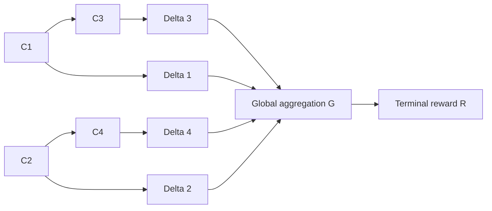

# 局部 Delta 与整体 Value：稀疏依赖下的信息稀释
# Local Delta and Global Value: Information Dilution under Sparse Dependencies

Last updated: 10/02/2026

## 1. 核心观点 / Main idea

**中文。** 假设不同 chunk 之间只有稀疏依赖，每个 chunk 对应一个由其内容确定的局部贡献 delta。整体结果由所有 delta 聚合得到，而前缀 value 还需要对尚未观察到的贡献求条件期望。这样的聚合与边缘化可以削弱单个 chunk 对终局奖励的信息，即使该 chunk 完全确定自己的 delta。

**English.** Assume that chunks have sparse dependencies and that each chunk determines a local contribution, called its delta. The overall outcome aggregates all deltas, while a prefix value additionally takes a conditional expectation over unobserved contributions. This aggregation and marginalization can weaken the information that an individual chunk provides about the terminal reward, even when the chunk fully determines its own delta.

**中文。** 必须区分两个结论：本文给出的例子严格证明了局部信息在终局监督中被稀释；“学习 value 比学习 delta 更困难”则需要额外指定函数类、监督方式、样本预算和误差指标，不能仅由稀疏依赖或确定性推出。

**English.** Two claims must be distinguished. The example below rigorously establishes dilution of local information in terminal supervision. A claim that learning a value function is harder than learning local deltas additionally requires a function class, a supervision protocol, a sample budget, and an error criterion. Sparse dependencies and determinism alone do not establish that claim.

## 2. 符号与假设 / Notation and assumptions

| 符号 / Symbol | 中文 | English |
| --- | --- | --- |
| $C_{1:n}=(C_1,\ldots,C_n)$ | 随机 chunk 序列 | Random chunk sequence |
| $c_{1:n}$ | 一个具体的 chunk 序列 | A realization of the chunk sequence |
| $\operatorname{pa}(t)$ | chunk $t$ 在依赖图中的父节点 | Parents of chunk $t$ in the dependency graph |
| $\Delta_t=f_t(C_t)$ | chunk $t$ 的确定性局部贡献 | Deterministic local contribution of chunk $t$ |
| $G$ | 聚合所有局部贡献的函数 | Function aggregating all local contributions |
| $R$ | 终局奖励，主要考虑二元奖励 | Terminal reward, primarily binary |
| $V_t(c_{\le t})$ | 给定前缀后的期望终局奖励 | Expected terminal reward given a prefix |

**中文。** 为使用离散熵，假设相关变量离散且所用熵有限，所有对数以 2 为底。本笔记中的 delta 指 chunk 的局部贡献；它不自动等同于 TD error 或相邻前缀 value 的差。

**English.** Variables are discrete, all entropies used are finite, and logarithms are base 2. A delta in this note means a local chunk contribution. It is not automatically a temporal difference error or a difference between consecutive prefix values.

### 2.1 稀疏的 chunk 依赖 / Sparse chunk dependencies

$$
P(C_{1:n})
=\prod_{t=1}^{n}P(C_t\mid C_{\operatorname{pa}(t)}),
\qquad
\operatorname{pa}(t)\subseteq\{1,\ldots,t-1\},
\qquad
|\operatorname{pa}(t)|\le k\ll n.
$$

**中文。** 该分解规定一个按时间排序的稀疏有向无环图。稀疏直接依赖并不等于弱依赖或相互独立：信息仍然可以沿长依赖链传播。

**English.** This factorization specifies a sparse directed acyclic graph ordered by time. Sparse direct dependencies do not imply weak dependence or mutual independence: information can still propagate along long dependency chains.

### 2.2 确定的局部贡献 / Deterministic local contributions

$$
\Delta_t=f_t(C_t).
$$

**中文。** 给定一个 chunk，其 delta 无需知道未来 chunk 就可以确定。同一个 chunk 实例的 delta 不随当前观察到的位置变化；尚未观察到的 chunk 的 delta 仍然是随机变量。这是关于 delta 的建模假设，而非由依赖图推出的结论。

**English.** Given a chunk, its delta can be determined without observing future chunks. The delta of a fixed chunk instance does not change with the current observation position; the deltas of unobserved chunks remain random variables. This is a modeling assumption about deltas, not a consequence of the dependency graph.

因此 / Consequently,

$$
H(\Delta_t\mid C_t)=0,
\qquad
I(\Delta_t;C_t\mid C_{<t})=H(\Delta_t\mid C_{<t}).
$$

**中文。** 一般不能把最后一项替换为 $H(\Delta_t)$。只有当 $\Delta_t$ 与 $C_{<t}$ 独立时，这一步才成立。

**English.** The last term cannot generally be replaced by $H(\Delta_t)$. That replacement requires independence between $\Delta_t$ and $C_{<t}$.

### 2.3 全局聚合 / Global aggregation

$$
R=G(\Delta_1,\ldots,\Delta_n).
$$

**中文。** 所有 delta 共同确定终局奖励，因此它们对预测终局奖励是充分的。若 delta 具有可加含义，可以进一步假设：

**English.** All deltas jointly determine the terminal reward and are therefore sufficient for predicting it. If deltas have an additive interpretation, one may further assume:

$$
S=\sum_{i=1}^{n}\Delta_i,
\qquad
R=g(S).
$$

例如 / For example,

$$
R=\mathbf 1\{S\ge\tau\}.
$$

**中文。** 可加性是额外假设。一般的 $G$ 可以包含交互作用，并不一定能化为各 delta 的和。

**English.** Additivity is an additional assumption. A general $G$ may contain interactions and need not reduce to a sum of deltas.

下面给出一个稀疏依赖图的示例；具体边仅作示意。

The following is an example of a sparse dependency graph; its particular edges are illustrative.

## 3. 完整序列没有 averaging 不确定性 / No averaging uncertainty given the full sequence

$$
P(R=r\mid C_{1:n}=c_{1:n})
=\mathbf 1\!\left\{
r=G(f_1(c_1),\ldots,f_n(c_n))
\right\}.
$$

因此 / Therefore,

$$
H(R\mid C_{1:n})=0,
\qquad
I(R;C_{1:n})=H(R).
$$

**中文。** 完整序列上的条件分布是点质量。即使 $G$ 很复杂，也不会使真实的条件分布变平。若写成对所有 delta 的求和，由于各 delta 是确定的，求和中只有一个 delta 向量具有非零概率。

**English.** The conditional distribution given the full sequence is a point mass. Even a complicated $G$ does not flatten this true conditional distribution. If the distribution is written as a sum over delta vectors, only one vector has nonzero probability because every delta is deterministic.

另有 / We also have:

$$
I(R;C_{1:n})=H(R)
\le H(\Delta_{1:n})
=I(\Delta_{1:n};C_{1:n}).
$$

**中文。** 这个不等式比较的是终局奖励与整个 delta 向量。它不保证 $I(R;C_{1:n})<I(\Delta_t;C_t)$，也不单独证明学习难度差异。二元奖励的熵至多为 1 bit，本身就限制了它能编码的信息量。

**English.** This inequality compares the terminal reward with the entire delta vector. It does not guarantee $I(R;C_{1:n})<I(\Delta_t;C_t)$ and does not by itself establish a learning difficulty gap. A binary reward has entropy at most one bit, which already limits how much information it can encode.

## 4. Averaging 出现在未观察部分的边缘化中 / Averaging arises from marginalizing unobserved chunks

给定一个前缀，定义 / Given a prefix, define:

$$
V_t(c_{\le t})
=\mathbb E[R\mid C_{\le t}=c_{\le t}].
$$

对于二元奖励 / For a binary reward,

$$
V_t(c_{\le t})=P(R=1\mid C_{\le t}=c_{\le t}).
$$

其正确的展开为 / Its expansion is:

$$
V_t(c_{\le t})
=\sum_{c_{>t}}
G(f_1(c_1),\ldots,f_n(c_n))
P(c_{>t}\mid c_{\le t}).
$$

在可加模型下 / Under the additive model,

$$
V_t(c_{\le t})
=\mathbb E\!\left[
g\!\left(
\sum_{i\le t}f_i(c_i)+\sum_{i>t}f_i(C_i)
\right)
\middle| C_{\le t}=c_{\le t}
\right].
$$

**中文。** 已观察部分的贡献已经确定，未观察部分的贡献则根据其条件分布被平均。稀疏图给出了该分布的因子分解，但并不自动保证求和容易，也不自动保证预测不确定性很高。

**English.** Contributions from observed chunks are fixed, while contributions from unobserved chunks are averaged according to their conditional distribution. The sparse graph supplies a factorization of that distribution, but does not automatically make the sum easy to compute or guarantee high predictive uncertainty.

**中文。** 完整 delta 向量对 $R$ 充分，并不意味着前缀 delta 对 $R$ 充分。前缀 chunk 还可能携带预测未来 chunk 的信息。将条件 $C_{\le t}$ 替换为 $\Delta_{\le t}$ 需要额外假设，例如：

**English.** Sufficiency of the full delta vector for $R$ does not imply sufficiency of the prefix deltas. Prefix chunks may carry additional information about future chunks. Replacing conditioning on $C_{\le t}$ with conditioning on $\Delta_{\le t}$ requires an additional assumption, such as:

$$
R\perp C_{\le t}\mid\Delta_{\le t}.
$$

## 5. 严格例子：多数投票中的信息稀释 / A rigorous example: information dilution in majority voting

### 5.1 构造 / Construction

令 / Let

$$
n=2m+1,\qquad m\ge1,
$$

$$
C_i\overset{\mathrm{iid}}{\sim}\operatorname{Bernoulli}(1/2),
\qquad
\Delta_i=C_i,
$$

$$
R=\mathbf 1\!\left\{\sum_{i=1}^{n}\Delta_i\ge m+1\right\}.
$$

**中文。** 独立是稀疏依赖的一个特例，即没有 chunk 之间的边。该构造用来证明信息稀释可以发生，不是证明所有稀疏依赖系统都会如此。

**English.** Independence is a special case of sparse dependence with no edges between chunks. This construction proves that information dilution can occur; it does not prove that it occurs in every system with sparse dependencies.

每个 chunk 完全揭示自己的 delta / Every chunk fully reveals its own delta:

$$
I(\Delta_i;C_i)=H(\Delta_i)=1\ \text{bit}.
$$

### 5.2 单个 chunk 对终局奖励的信息 / Information from one chunk about the terminal reward

定义其余 chunk 的贡献 / Define the contribution of all other chunks:

$$
T_i=\sum_{j\ne i}C_j\sim\operatorname{Binomial}(2m,1/2),
$$

以及平票概率 / and the tie probability:

$$
q_m=P(T_i=m)=\frac{\binom{2m}{m}}{2^{2m}}.
$$

**中文。** 改变 $C_i$ 只有在其余 chunk 恰好平票时才会改变 $R$。由二项分布的对称性：

**English.** Changing $C_i$ changes $R$ only when the remaining chunks are tied. By symmetry of the binomial distribution:

$$
P(R=1\mid C_i=1)=P(T_i\ge m)=\frac12+\frac{q_m}{2},
$$

$$
P(R=1\mid C_i=0)=P(T_i\ge m+1)=\frac12-\frac{q_m}{2}.
$$

定义二元熵 / Define the binary entropy:

$$
h_2(p)=-p\log_2p-(1-p)\log_2(1-p).
$$

由于 $P(R=1)=1/2$，有 / Since $P(R=1)=1/2$,

$$
\begin{aligned}
I(R;C_i)
&=H(R)-H(R\mid C_i)\\
&=1-h_2\!\left(\frac12+\frac{q_m}{2}\right).
\end{aligned}
$$

利用中心二项系数与二元熵的展开 / Using the central binomial coefficient asymptotic and the binary entropy expansion,

$$
q_m\sim\frac{1}{\sqrt{\pi m}},
\qquad
1-h_2(1/2+x)=\frac{2x^2}{\ln 2}+O(x^4),
$$

得到 / we obtain:

$$
I(R;C_i)
=\frac{q_m^2}{2\ln 2}+O(q_m^4)
\sim\frac{1}{2\pi m\ln 2}
=\Theta(1/n).
$$

因此 / Hence,

$$
\boxed{
I(\Delta_i;C_i)=1,
\qquad
I(R;C_i)=\Theta(1/n).
}
$$

**中文。** 一个 chunk 对自己的 delta 始终提供完整的 1 bit 信息，但它对终局奖励的信息随聚合规模增加而趋于零。这就是一个严格的“局部信号被其他贡献平均稀释”的例子。

**English.** A chunk always provides one full bit about its own delta, while its information about the terminal reward tends to zero as the aggregation size increases. This gives a rigorous example of a local signal being diluted by averaging over other contributions.

### 5.3 前缀 value 与完整信息 / Prefix value and full information

令已观察到的和为 / Let the observed sum be:

$$
s_t=\sum_{i\le t}c_i.
$$

由于未来 chunk 独立 / Since future chunks are independent,

$$
V_t(c_{\le t})
=P\!\left(B_{n-t}\ge m+1-s_t\right),
\qquad
B_{n-t}\sim\operatorname{Binomial}(n-t,1/2).
$$

**中文。** 这直接展示了前缀 value 如何平均未来贡献。完整序列仍然确定奖励：

**English.** This directly displays how prefix value averages future contributions. The full sequence still determines the reward:

$$
I(R;C_{1:n})=H(R)=1.
$$

由互信息链式法则 / By the chain rule for mutual information,

$$
\sum_{t=1}^{n}I(R;C_t\mid C_{<t})=1,
$$

而 / whereas

$$
\sum_{t=1}^{n}I(\Delta_t;C_t\mid C_{<t})=n.
$$

**中文。** 终局奖励的平均条件信息增量为 $1/n$ bit；这不意味着每一个位置的条件信息增量都等于 $1/n$。前面推导的 $\Theta(1/n)$ 则是每个单独 chunk 的无条件互信息。

**English.** The average conditional information increment about the terminal reward is $1/n$ bit. Individual positions need not each contribute exactly $1/n$. The earlier $\Theta(1/n)$ result concerns the unconditional mutual information of each individual chunk.

## 6. 从信息稀释到学习难度 / From information dilution to learning difficulty

**中文。** 上面的证明比较的是已指定数据分布下的信息量。它本身并未证明某个学习算法需要更多样本或更大的模型。确定性目标可能很难学习；具有随机输出的条件均值也可能非常容易学习。例如在上述多数投票模型中，若分布和聚合规则已知，前缀 value 可直接由二项分布尾概率计算。

**English.** The proof above compares information under a specified data distribution. By itself, it does not establish that a learning algorithm needs more samples or a larger model. Deterministic targets can be hard to learn, and conditional means of random outcomes can be easy to learn. For example, if the distribution and aggregation rule in the majority model are known, the prefix value can be computed directly from a binomial tail probability.

**中文。** 另外，“不重要的 chunk 有更平的局部条件分布”与当前确定性假设不一致：所有 $P(\Delta_t\mid C_t)$ 都是点质量。重要性可以通过改变 delta 对 $G$ 的影响、影响终局结果的概率或与 $R$ 的互信息来表达；这些定义彼此也不总是等价。

**English.** The claim that unimportant chunks have flatter local conditional distributions is incompatible with the present determinism assumption: every $P(\Delta_t\mid C_t)$ is a point mass. Importance can instead be expressed through sensitivity of $G$ to a delta, the probability that a delta changes the outcome, or mutual information with $R$. These definitions are not always equivalent.

要证明学习难度差异，需要明确 / A learning difficulty comparison must specify:

1. **未知对象 / Unknown object:** 哪些 $f_t$、聚合函数 $G$ 或 chunk 分布参数未知。 / Which local functions, aggregation function, or distribution parameters are unknown.
2. **可用监督 / Available supervision:** 是否能直接观察真实 delta，或只有终局奖励。 / Whether true deltas are observed directly or only terminal rewards are available.
3. **样本预算 / Sample budget:** 按轨迹数、标签数还是标注成本计算。 / Whether the budget counts trajectories, labels, or annotation cost.
4. **目标与误差 / Target and error:** 学习局部函数、完整奖励映射，还是前缀条件均值，以及相应误差。 / Whether the target is a local function, the full reward map, or a prefix conditional mean, and how its error is measured.
5. **比较条件 / Comparison conditions:** 两种方法使用的函数类、输入信息和已知结构。 / The function classes, inputs, and known structure available to each method.

## 7. 正确使用 Fano 不等式 / Applying Fano's inequality correctly

**中文。** 若要用 Fano 不等式分析学习，应令 $\Theta$ 表示未知模型索引，并研究训练数据提供多少关于 $\Theta$ 的信息。设 $\Theta$ 均匀分布在 $M\ge2$ 个候选模型上。

**English.** To use Fano's inequality for learning, let $\Theta$ index the unknown model and study how much information the training data provides about it. Assume $\Theta$ is uniform over $M\ge2$ candidate models.

比较两种监督数据 / Compare two supervision datasets:

$$
D_{\mathrm{terminal}}
=\{(C_{1:n}^{(j)},R^{(j)})\}_{j=1}^{N},
$$

$$
D_{\mathrm{local}}
=\{(C_{1:n}^{(j)},\Delta_{1:n}^{(j)})\}_{j=1}^{N}.
$$

对任意模型识别器 $\widehat\Theta(D)$，Fano 给出 / For any model estimator $\widehat\Theta(D)$, Fano gives:

$$
P(\widehat\Theta\ne\Theta)
\ge
1-\frac{I(\Theta;D)+1}{\log_2 M}.
$$

**中文。** 因而，相关的信息量是 $I(\Theta;D)$，而不是只看 $I(R;C_{1:n})$。要将模型识别错误率下界转为 value 预测误差下界，还需要构造在目标预测度量下充分分离的候选 value 函数。Fano 提供错误率下界，本身不提供局部学习方法的可达上界；完整的难度分离还需要这样的上界。关于 Fano 及其统计估计用途，见 [MIT 信息论讲义，第 5 章](https://ocw.mit.edu/courses/6-441-information-theory-spring-2016/pages/lecture-notes/)。

**English.** The relevant quantity is therefore $I(\Theta;D)$, rather than just $I(R;C_{1:n})$. Converting a model identification lower bound into a value prediction lower bound requires candidate value functions that are sufficiently separated in the target prediction metric. Fano supplies an error lower bound; it does not supply an achievable upper bound for local learning. A complete learning difficulty separation also needs such an upper bound. See [MIT's information theory notes, Chapter 5](https://ocw.mit.edu/courses/6-441-information-theory-spring-2016/pages/lecture-notes/) for Fano and its statistical estimation applications.

**中文。** 若 $G$ 固定且已知，则终局数据可以从局部数据确定性地生成，所以由数据处理不等式，$I(\Theta;D_{\mathrm{terminal}})\le I(\Theta;D_{\mathrm{local}})$。这仍不保证严格不等式，也不保证严格的样本复杂度分离。若未知参数包含 $G$，这一数据转换未必可用。

**English.** If $G$ is fixed and known, terminal data can be generated deterministically from local data. The data processing inequality then yields $I(\Theta;D_{\mathrm{terminal}})\le I(\Theta;D_{\mathrm{local}})$. This does not guarantee a strict inequality or a strict sample complexity separation. If the unknown parameter includes $G$, this data conversion need not be available.

**中文。** 同一条轨迹给出一个终局标签，但可能给出 $n$ 个局部标签。比较时必须报告这个监督预算差异；如果 delta 标签来自额外估计器，还需要计入其误差和获取成本。

**English.** One trajectory supplies one terminal label but may supply $n$ local labels. A comparison must report this supervision budget difference. If delta labels come from an additional estimator, their error and acquisition cost must also be accounted for.

## 8. 可直接引用的表述 / Suggested standalone statement

### 中文

我们假设 chunk 之间具有稀疏依赖，每个 chunk 的局部贡献由其内容确定，且该贡献的定义不依赖尚未观察的未来 chunk。终局奖励是全部局部贡献的确定性聚合，而前缀 value 是在给定已观察 chunk 的条件下，对其余贡献边缘化得到的期望终局奖励。边缘化可以稀释单个 chunk 对终局奖励的信息，即使该 chunk 完全确定自己的局部贡献。在一个包含 $n$ 个独立二元 chunk 的多数投票模型中，单个 chunk 对其局部贡献提供 1 bit 信息，而对终局奖励只提供 $\Theta(1/n)$ bit 信息。这说明终局监督可能为学习局部贡献提供较弱的信号；要进一步证明 value 学习的样本复杂度更高，还需要指定未知函数类、监督预算和预测误差指标，并建立相应的下界与可达上界。

### English

We assume sparse dependencies among chunks and a deterministic local contribution for each chunk, defined without reference to unobserved future chunks. The terminal reward is a deterministic aggregation of all local contributions, whereas the prefix value is the expected terminal reward obtained by marginalizing unobserved contributions conditional on the observed chunks. This marginalization can dilute the information that an individual chunk provides about the terminal reward, even when that chunk fully determines its own local contribution. In a majority voting model with $n$ independent binary chunks, an individual chunk provides one bit about its local contribution but only $\Theta(1/n)$ bits about the terminal reward. This shows that terminal supervision can provide a weaker signal for learning local contributions. Establishing a higher sample complexity for value learning additionally requires a specified unknown function class, supervision budget, prediction error metric, and corresponding lower and achievable upper bounds.
